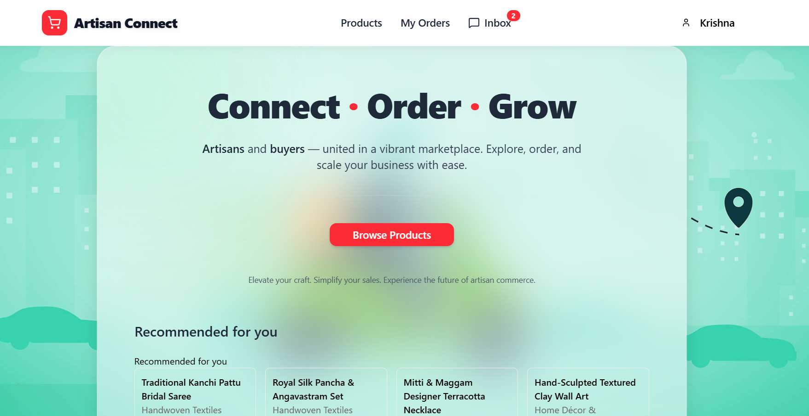
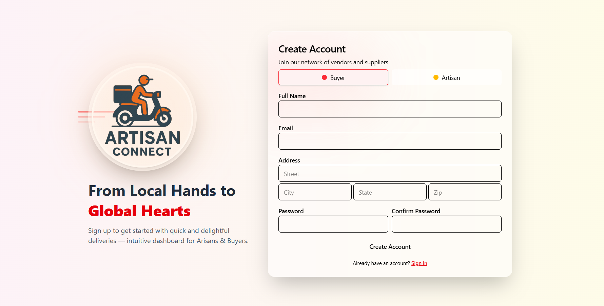
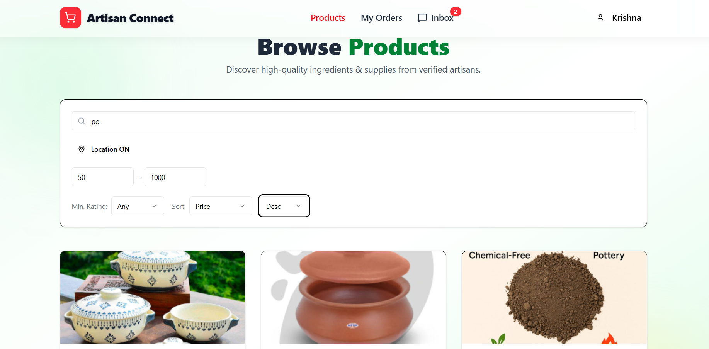
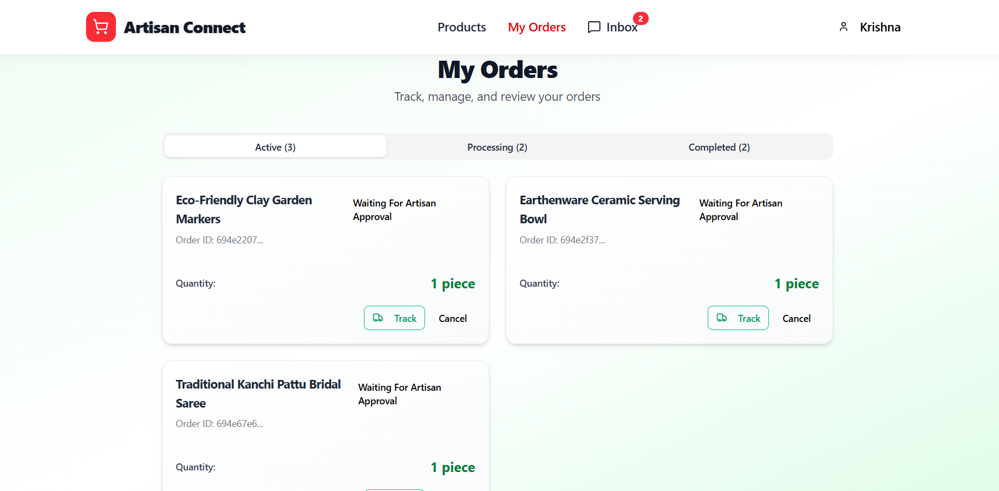
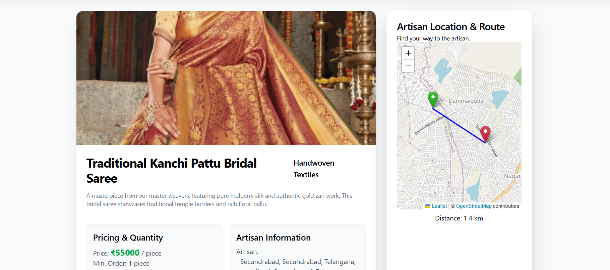

# 🎨 ArtisanConnect
> **Bridging the gap between local artisans and global buyers through smart, location-aware commerce.**

<div align="center">
  
  <br />
</div>


---

## 🚀 Live Demo
**[Click here to Explore the Artisan Marketplace](https://artisan-connect-pi.vercel.app/)** *(Note: As this is hosted on a free tier, the server may take a minute to spin up on the first load.)*

---

## 📖 Introduction

**ArtisanConnect** is a hyperlocal marketplace platform designed to empower local artisans by connecting them directly with buyers. Unlike standard e-commerce platforms, ArtisanConnect utilizes **AI-driven context-aware recommendations** (considering weather, festivals, and location) and real-time mapping to facilitate local discovery and logistics.

Built during a hackathon, this project solves the problem of "visibility" for small-scale creators by providing them with professional tools like analytics, order tracking, and direct chat.

## 📸 Screenshots

| **Landing Page** | **Registration Page** |
|:---:|:---:|
|  |  |
| *User-friendly Landing Page* | *User-friendly Registration Page* |

| **Product Catalog** | **Order Management** |
|:---:|:---:|
|  |  |
| *Search, Filter & Currency Conversion* | *Status Tracking & History* |

| **AI Recommendations** | **Map & Tracking** |
|:---:|:---:|
|  |  |
| *Context-aware Suggestions* | *Real-time Routing* |

## ✨ Key Features

### 🛍️ For Buyers
* **Context-Aware AI Recommendations:** Uses `LightFM` and `Hugging Face` embeddings to recommend products based on current weather, festivals, and user location.
* **Interactive Maps:** View artisan locations on a map using **Leaflet**, calculate distances, and view delivery routes.
* **Direct Chat:** Real-time messaging with artisans to discuss custom orders.
* **Multi-Language Support:** Integrated Google Translate for accessibility.

### 🎨 For Artisans
* **Business Dashboard:** Visual analytics for monthly revenue and top-selling products using **Recharts**.
* **Product Management:** Easy upload of products with images (stored via **Cloudinary**).
* **Order Management:** Accept/Reject orders, update status (Processing, Delivered), and track logistics.

### 🔐 Security & Core
* **Authentication:** Secure JWT-based auth with Email OTP verification.
* **Role-Based Access Control:** Distinct portals for Buyers and Artisans.

## 🏗️ System Architecture

ArtisanConnect uses a microservice-lite architecture where the Node.js backend handles business logic and communicates with a Python FastAPI service for ML inference.


## 🛠️ Tech Stack

### Frontend
* **Framework:** React (Vite)
* **Styling:** Tailwind CSS, Shadcn UI
* **Maps:** React-Leaflet, Leaflet Routing Machine
* **State Management:** React Query (TanStack)

### Backend
* **Runtime:** Node.js & Express
* **Database:** MongoDB (Mongoose)
* **Storage:** Cloudinary (Image hosting)
* **Email:** Nodemailer (OTP & Notifications)

### AI & Machine Learning Service
* **Framework:** Python FastAPI
* **Models:** LightFM (Collaborative Filtering), Hugging Face (Text Embeddings)
* **Libs:** Pandas, Scipy, NumPy

## 🚀 Installation & Setup

### Prerequisites
* Node.js (v18+)
* Python (v3.9+)
* MongoDB Atlas URI
* Cloudinary Account

### 1. Clone the Repository
```bash
git clone https://github.com/Krishna18113/ArtisanConnect.git
cd ArtisanConnect
```

### 2. Backend Setup
```bash
cd backend
npm install
node index.js
```

### 3. Frontend Setup
```bash
cd frontend
npm install
npm run dev
```

### 4. ML Service Setup
```bash
cd backend/ml-service
pip install -r requirements.txt # or install fastapi uvicorn lightfm numpy scipy
```
uvicorn main:app --reload --port 8001

## 🔑 Environment Variables
Create a .env file in the backend/ directory:
```bash
PORT=5000
MONGO_URI=your_mongodb_connection_string
JWT_SECRET=your_jwt_secret

# Cloudinary
CLOUDINARY_CLOUD_NAME=your_cloud_name
CLOUDINARY_API_KEY=your_api_key
CLOUDINARY_API_SECRET=your_api_secret

# Email Service
EMAIL_USER=your_mail
EMAIL_PASS=your_pass_key
JWT_SECRET=your_jwt_secret

# AI Service
ML_SERVICE_URL=http://localhost:8001
HUGGINGFACE_TOKEN=your_token
HF_EMBED_MODEL=BAAI/bge-m3
```

Create a .env file in the backend/ directory:
```bash
VITE_API_URL=http://localhost:5000/api
VITE_GOOGLE_MAPS_API_KEY=your_google_maps_api_key
```

## 🤝 The Team
Built with ❤️ by CodeSurfers
- Gattu Krishna Venkat Sai - Full Stack & System Design
- Dasari Sai Teja - Frontend & UI/UX
- C. Madhusudhan - ML & Backend Integration

## Built with ❤️, Caffeine, and Sleepless Nights.
